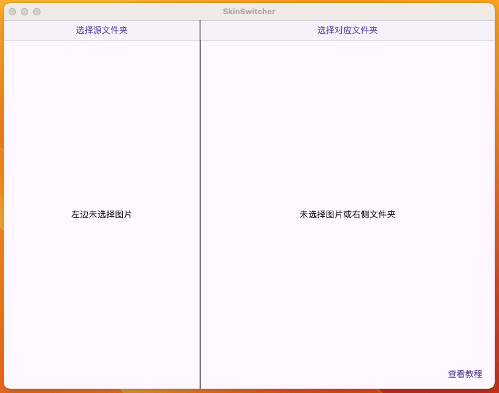
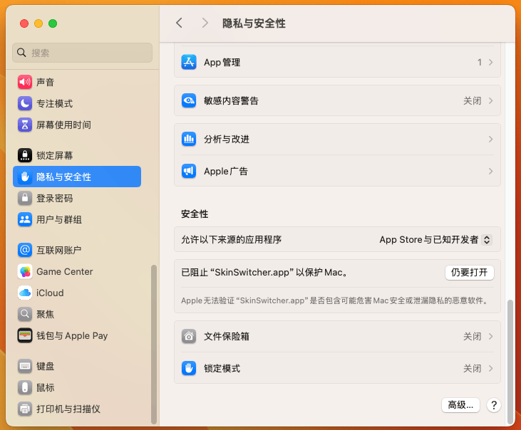

# SkinSwitcher

SkinSwitcher 是一个 macOS 桌面应用，用于快速对应和切换不同文件夹中的图片（如皮肤或外观）。该应用允许用户拖拽图片，快速查看和复制不同文件夹中的对应图片。

## 🎨 功能介绍

- **文件夹选择**：轻松选择左右两侧的文件夹，快速预览其中的图片。
- **图片拖拽**：支持拖拽图片以创建对应关系，并支持不同格式的图片（如 `.png`, `.jpg`, `.jpeg`, `.gif`）。
- **快速复制**：当某些图片没有对应的文件时，支持一键快速复制源文件到目标文件夹。
- **图片预览**：提供简洁直观的图片预览功能，支持删除、替换图片。

## 🖼️ 界面

## 🚀 安装指南

### 系统要求
- macOS 10.15 及更高版本

### 下载与安装

1. 前往 [Releases](https://github.com/XFSeven7/SkinSwitcher/releases/) 页面，下载最新版本的 `.zip` 文件。
2. 解压下载的文件，并将 `SkinSwitcher.app` 移动到你的应用程序文件夹。
3. 由于应用未签名，初次打开时可能会遇到安全警告。请按照以下步骤打开应用：
    - 右键点击 `SkinSwitcher.app`，选择 **打开**。
    - 在弹出的对话框中选择 **仍要打开**。
    - 如果对话框中没有出现**仍要打开**，在系统设置-隐私与安全性中，点击**仍要打开**
      

## 📚 使用指南

1. 打开应用后，点击左侧按钮选择源文件夹，右侧按钮选择目标文件夹。
2. 从左侧文件夹中选择一张图片，应用会自动查找右侧文件夹中的对应图片。
3. 如果没有对应图片，可以通过拖拽或点击 "快速复制" 按钮创建对应关系。
4. 拖拽文件到右侧文件夹，或删除不需要的文件。

